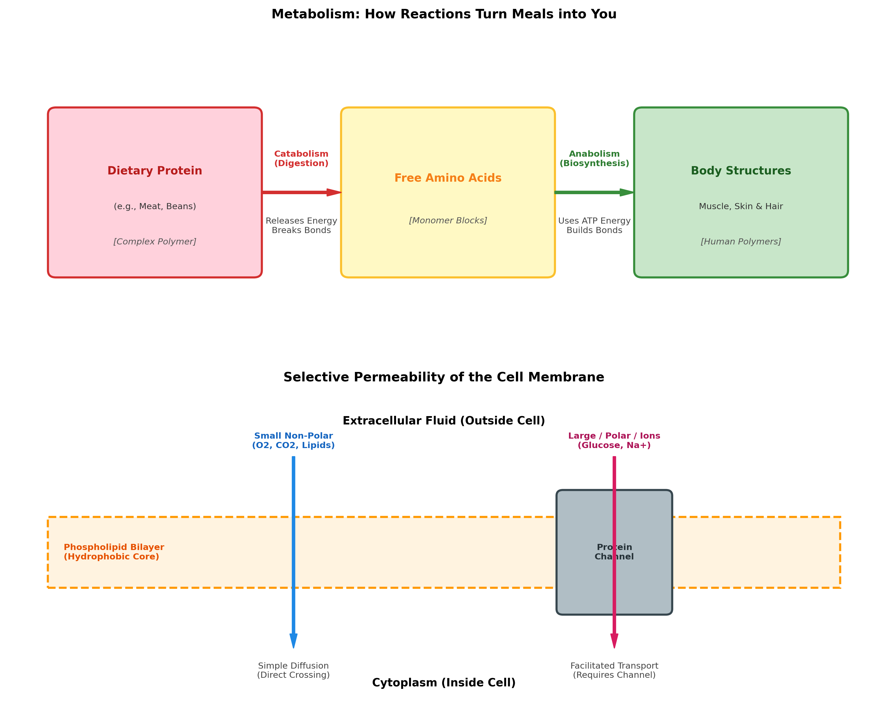

# biology of happiness - unit 1: the facts of life

this project covers the foundational biological concepts required for the unit 1 summative assessment.

---

## 1. diagrams

### panel 1: metabolism (turning meals into you)

- **catabolism (digestion):** breaks down complex dietary protein polymers into free amino acid monomers, releasing energy.
- **anabolism (biosynthesis):** uses cellular energy (atp) to reassemble amino acids into body structures like actin/myosin in muscle and keratin in hair/skin.

### panel 2: cell membrane selective permeability
- **phospholipid bilayer:** creates a hydrophobic barrier preventing unassisted crossing of charged or polar substances.
- **simple diffusion:** small, non-polar molecules (like o2 and co2) pass directly across the lipid bilayer.
- **facilitated transport:** large, polar, or ionic particles (like glucose and na+) cross via specialized protein channels.

---

## 2. core concepts

### macromolecules build and run cells
- **carbohydrates:** provide immediate chemical energy (glucose) and short-term energy storage (glycogen).
- **lipids:** form the non-polar phospholipid bilayer of cellular membranes and store long-term energy.
- **proteins:** act as enzymes to catalyze metabolic reactions, provide structural shape, and form membrane transport channels.
- **nucleic acids (dna & rna):** store and transmit hereditary genetic code that provides instructions for building all cellular proteins.

### life as an emergent property
- **concept:** an emergent property is a characteristic that appears when smaller parts interact within a complex system, which individual components cannot produce on their own.
- **living vs non-living matter:** individual atoms (carbon, hydrogen, oxygen) and molecules (water, amino acids) are non-living. when organized into a bounded cellular system with metabolic processes and feedback loops, the property of life emerges.

### structure influences function
- **relationship:** the physical 3d shape and chemical arrangement of a biological component determine what specific job it can perform.
- **example:** an enzyme has an active site shaped specifically for its substrate (lock and key).
- **impact of change:** if the structure is altered by heat or ph changes (denaturation), the substrate cannot fit, and the biological function is lost completely.

---

## 3. repository files
- `biology_unit1_diagrams.png`: generated full-size image containing both project diagrams.
- `biology_unit1_diagrams.pdf`: vector pdf export of the diagrams.
- `unit 1 project.py`: source python script using matplotlib to render the models.
